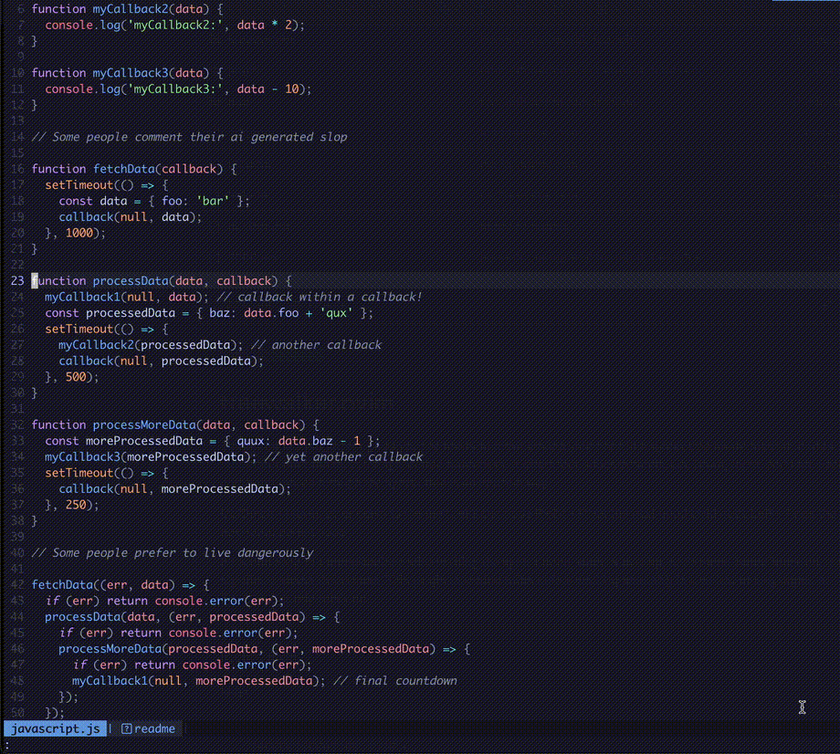
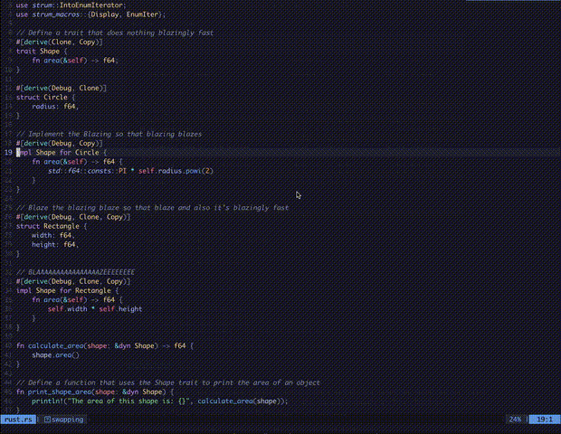

<div align="center">
    <h1>Treewalker.nvim<br><br>🌳🌲🌴🌲🌴🌳</h1>
    
    <h2><strong>🚀 FORK: This is a fork of treewalker.nvim that includes parent navigation functionality</strong></h2>
    
    <h4 align="center">
        <a href="#Installation">Installation</a>
        ·
        <a href="#Mapping">Mapping</a>
        ·
        <a href="#parent-navigation">Treewalker Parent</a>
    </h4>
    <a href="https://neovim.io/">
        
    </a>
    
    
    
    
</div>

<br>

<div align="center">
    
</div>

<div align="center">
    <h2>Move around your code in a syntax tree aware manner.</h2>
    <p>
        Treewalker uses neovim's native <a href="https://github.com/tree-sitter/tree-sitter">Treesitter</a> under the hood for syntax tree awareness.
        Design goals include stability, ergonomics, and simplicity.
    </p>
</div>

---

## Movement

The movement commands move you through your code in an intuitive way, skipping nodes that don't help you move quickly:

* **`:Treewalker Up`** - Moves up to the previous neighbor node
* **`:Treewalker Down`** - Moves down to the next neighbor node
* **`:Treewalker Left`** - Moves to the first ancestor node that's on a different line from the current node
* **`:Treewalker Right`** - Moves to the next node down that's indented further than the current node

For markdown files, Treewalker navigates around headings (#, ##, etc.)

All movement commands by default add to the [`jumplist`](https://neovim.io/doc/user/motion.html#jumplist), so if you use a movement command
and then feel lost, you have `Ctrl-o` available to bring you back to where you last were.

---

## Parent Navigation

**🚀 NEW FEATURE: This fork includes parent navigation functionality that allows you to navigate up the syntax tree hierarchy.**

The parent navigation command intelligently navigates to meaningful parent nodes, skipping trivial wrapper nodes like single-child containers and focusing on semantically important structures like function definitions, classes, control flow statements, and object declarations.

* **`:Treewalker Parent`** - Moves to the next non-trivial parent node in the syntax tree

### Examples of Parent Navigation

```javascript
const obj = {
  a: {
    b: {
      c: function() {
        if (condition) {
          return "here"; // ← cursor position
        }
      }
    }
  }
}
```

Starting from the cursor position on `"here"`, successive `:Treewalker Parent` commands would navigate to:
1. The `return` statement
2. The `if` statement  
3. The `function` definition
4. The object property `c`
5. The object `b`
6. The object property `b`
7. The object `a`
8. The root object declaration

The parent navigation **intelligently skips trivial wrapper nodes** like expression statements, parenthesized expressions, and single-child containers, focusing on nodes that represent meaningful code structure boundaries.

---

## Swapping

### Code files

`Swap{Up,Down}` operate on a linewise basis, and **bring along nodes' comments, decorators, and annotations**.
These are meant for swapping declarations and definitions - things that take up whole lines.

`Swap{Left,Right}` are meant for swapping function arguments, enum members, list elements, etc. Things that are many per line.
In some cases these will operate on the same nodes as Up/Down, but won't take the accoutrements.

* **`:Treewalker SwapUp`** - Swaps the highest node on the line upwards in the document
* **`:Treewalker SwapDown`** - Swaps the biggest node on the line downward in the document
* **`:Treewalker SwapLeft`** - Swap the node under the cursor with its previous neighbor
* **`:Treewalker SwapRight`** - Swap the node under the cursor with its next neighbor

### Markdown

Like in movement, swapping in markdown operates against headings.

* **`:Treewalker SwapUp`** - Swaps the current heading and its subtree with the previous heading at the same level, moving the whole section upward
* **`:Treewalker SwapDown`** - Swaps the current heading and its subtree with the next heading at the same level, moving the whole section downward

---

## More Examples

<details>
<summary>Typing out the Move commands manually</summary>

</details>

<details>
<summary>Typing out the SwapUp/SwapDown commands manually</summary>

</details>

---

## Installation

**🚀 This is a fork with parent navigation functionality!** Use this fork's URL instead of the original.

#### [Lazy](https://github.com/folke/lazy.nvim)
```lua
{
  '3dyuval/treewalker.nvim', -- **This fork with parent navigation**

  -- The following options are the defaults.
  -- Treewalker aims for sane defaults, so these are each individually optional,
  -- and setup() does not need to be called, so the whole opts block is optional as well.
  opts = {
    -- Whether to briefly highlight the node after jumping to it
    highlight = true,

    -- How long should above highlight last (in ms)
    highlight_duration = 250,

    -- The color of the above highlight. Must be a valid vim highlight group.
    -- (see :h highlight-group for options)
    highlight_group = 'CursorLine',

    -- Whether the plugin adds movements to the jumplist -- true | false | 'left'
    --  true: All movements more than 1 line are added to the jumplist. This is the default,
    --        and is meant to cover most use cases. It's modeled on how { and } natively add
    --        to the jumplist.
    --  false: Treewalker does not add to the jumplist at all
    --  "left": Treewalker only adds :Treewalker Left to the jumplist. This is usually the most
    --          likely one to be confusing, so it has its own mode.
    jumplist = true,
  }
}
```

#### [Packer](https://github.com/wbthomason/packer.nvim)
```lua
use {
  '3dyuval/treewalker.nvim', -- **This fork with parent navigation**

  -- The setup function is optional, defaults are meant to be sane
  -- and setup does not need to be called
  setup = function()
      require('treewalker').setup({
        -- Whether to briefly highlight the node after jumping to it
        highlight = true,

        -- How long should above highlight last (in ms)
        highlight_duration = 250,

        -- The color of the above highlight. Must be a valid vim highlight group.
        -- (see :h highlight-group for options)
        highlight_group = 'CursorLine',

        -- Whether the plugin adds movements to the jumplist -- true | false | 'left'
        --  true: All movements more than 1 line are added to the jumplist. This is the default,
        --        and is meant to cover most use cases. It's modeled on how { and } natively add
        --        to the jumplist.
        --  false: Treewalker does not add to the jumplist at all
        --  "left": Treewalker only adds :Treewalker Left to the jumplist. This is usually the most
        --          likely one to be confusing, so it has its own mode.
        jumplist = true,
      })
  end
}
```

#### [Vim-plug](https://github.com/junegunn/vim-plug)
```vimscript
Plug '3dyuval/treewalker.nvim' " **This fork with parent navigation**

" This line is optional
:lua require('treewalker').setup({ highlight = true, highlight_duration = 250, highlight_group = 'CursorLine', jumplist = true })
```

---

## Mapping

I've found Ctrl - h / j / k / l to be a really natural flow for this plugin, and adding
Shift to that for swapping just felt so clean. **This fork adds parent navigation** which can be mapped to a convenient key.

In `init.lua`:

```lua
-- movement
vim.keymap.set({ 'n', 'v' }, '<C-k>', '<cmd>Treewalker Up<cr>', { silent = true })
vim.keymap.set({ 'n', 'v' }, '<C-j>', '<cmd>Treewalker Down<cr>', { silent = true })
vim.keymap.set({ 'n', 'v' }, '<C-h>', '<cmd>Treewalker Left<cr>', { silent = true })
vim.keymap.set({ 'n', 'v' }, '<C-l>', '<cmd>Treewalker Right<cr>', { silent = true })

-- 🚀 NEW: Parent navigation (this fork only)
vim.keymap.set({ 'n', 'v' }, '<C-p>', '<cmd>Treewalker Parent<cr>', { silent = true })

-- Alternative: You can also call the parent function directly
-- vim.keymap.set({ 'n', 'v' }, '<C-p>', require('treewalker').goto_parent, { silent = true })

-- swapping
vim.keymap.set('n', '<C-S-k>', '<cmd>Treewalker SwapUp<cr>', { silent = true })
vim.keymap.set('n', '<C-S-j>', '<cmd>Treewalker SwapDown<cr>', { silent = true })
vim.keymap.set('n', '<C-S-h>', '<cmd>Treewalker SwapLeft<cr>', { silent = true })
vim.keymap.set('n', '<C-S-l>', '<cmd>Treewalker SwapRight<cr>', { silent = true })
```

---

## Alternatives

* [syntax-tree-surfer](https://github.com/ziontee113/syntax-tree-surfer)
is publicly archived and I could not get it to work :/
`Treewalker` has a robust test suite, makes use of the type system, has CI
(automated testing), and has organized code. So the plugin should be pretty
stable. I believe `Treewalker` usage is a little bit simpler and more intuitive.
`Treewalker` is missing the visual selection swap feature that syntax-tree-surfer
has, though. (See [#32](https://github.com/3dyuval/treewalker.nvim/issues/32))

* [nvim-treehopper](https://github.com/mfussenegger/nvim-treehopper)
is similar in that it uses the AST to navigate, but it takes more of a
[leap](https://github.com/ggandor/leap.nvim) like approach, only annotating
interesting nodes.

* [nvim-treesitter-textobjects](https://github.com/nvim-treesitter/nvim-treesitter-textobjects)
can swap
[a subset of node types](https://github.com/nvim-treesitter/nvim-treesitter-textobjects?tab=readme-ov-file#built-in-textobjects),
but misses some types (ex. rust enums). `Treewalker` is not aware of node type
names, only the structure of the AST, so left/right swaps will work mostly
where you want it to. It can also move to nodes, but treats node types individually,
whereas `Treewalker` is agnostic about types and just goes to the next relevant node.

* [nvim-treesitter.ts_utils](https://github.com/nvim-treesitter/nvim-treesitter/blob/master/lua/nvim-treesitter/ts_utils.lua)
offers a programmatic interface for swapping nodes. It doesn't suffer from node
type awareness, and works mostly the same as `Treewalker` under the hood. Some
of `Treewalker`'s left/right swapping code is inspired by `ts_utils`.
`Treewalker` operates a little differently under the hood, picking the highest
startwise coinciding node over the lowest. But mostly it does the work of
finding the next relevant node and packaging it all up into a nice interface.

* [tree-climber.nvim](https://github.com/drybalka/tree-climber.nvim)
i discovered long after having made `Treewalker`. It seems to be the most
similar of all of these. It works mostly the same, but with a little bit less
refinement, including getting stuck on certain nodes, and navigating to nodes
that don't necessarily seem helpful to go to. In my usage, it seems like
`tree-climber` gives you more fine grained access to each individual node,
whereas `Treewalker` takes a more linewise approach which allows you to make
larger movements more easily. For movement inside of a single line, `Treewalker`
doesn't help much, whereas `tree-climber` does.

## Mentions

* [treesitter-unit](https://github.com/David-Kunz/treesitter-unit)
provides a textobject, along with highlighting for the current treesitter unit
(as navigated to by `Treewalker`). When combined with `Treewalker`, it's possible
to perform edits in ways analogous to Vim's builtin `{}` motions and `p`
textobject.

---

## **🚀 About This Fork**

**This is a fork of [3dyuval/treewalker.nvim](https://github.com/3dyuval/treewalker.nvim) that adds parent navigation functionality.** 

The original treewalker.nvim is an excellent plugin for syntax-aware navigation. This fork extends it with the ability to navigate up the syntax tree hierarchy to parent nodes, solving the "can navigate in but not out" problem while maintaining treewalker's philosophy of skipping uninteresting nodes.

All credit for the original plugin goes to [aaronik](https://github.com/aaronik) and the original contributors. This fork only adds the parent navigation feature.

